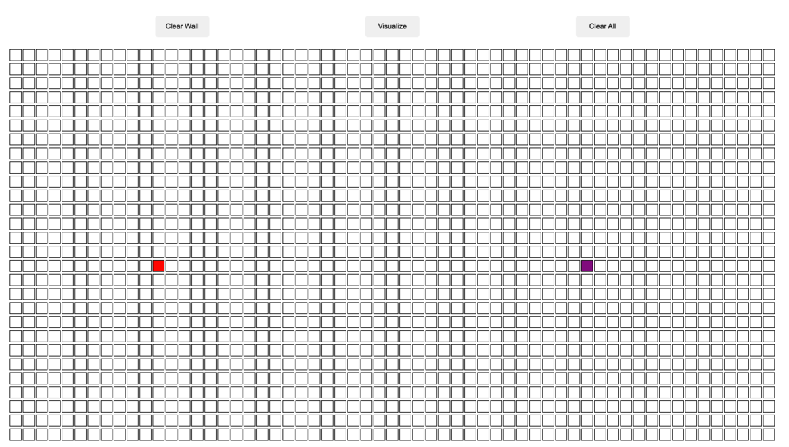
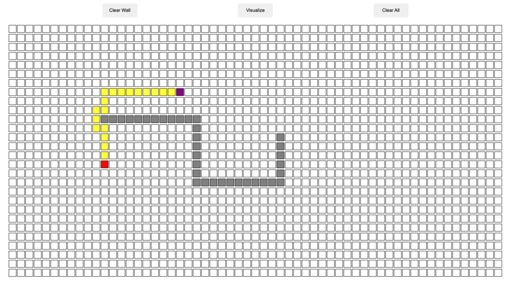

# Path-Finding-Visualizer

## Overview

This is my very first JavaScript Project using JavaScript, HTML and CSS. After two weeks of learning JavaScript, I was inspired by one of the Path Finding Visualizer by Clement (YouTuber). From there I decided to take my own initiative to build a similar path finding website and using my knowledge of A-star algorithm.

## Brief

- The user will able to design their own walls.
- The user will able to move the starting point and ending point around the boxed map.
- The user then will press start button and the yellow line is the best way to move from starting point to the end point.

## Timeframe and Technology

### Timeframe : 14 days

### Front End:

- Javascript
- HTML
- CSS

### Dev Tools:

- VSCode
- Git
- Git Hub
- Google Chrom Dev Tools

## Features and Pages

- This is a single page application
- Containing clear button - this clear the page and restart the board
- Containing restart button - this will restart and put the node ( starting node and ending node ) back to original position
- Containing clear wall button - this is to clear the wall

## Instruction

- Move the starting node or ending node to desired position
- Create walls around the board ( GO WILD ) by draging the empty box
- To remove some walls while maintaining the current set up, drag one of the walled box and drag along the board and all the box along the path will un-boxed
- Once everything set up, press the start button and it will invoke the A-star algorithm and connecting the ending node and starting node

## Approach Taken

- The approach I taken in this project is segregating section by section. I devided into three section:

  1. First section:
     - Understanding the mathematics behind the heuristic algorithm ( A-star Algorithm )
  2. Second section:
     - The wire framing of the website and what tools I'm going to use
  3. Third section:
     - Building the application from bone structure and build my way up ( the last step will be styling and animation )

- Once I'm done with understanding the math of the algorithm, I build the basic logic behind the math on the paper. Then I proceed into building the bone structure by starting working on the board/table. The challenge I face at this point is that how to create similar box wihtout repeating writing manually.

- Then I worked on the creating the starting and ending node on the board. Then I proceed on fcousing on how to move the node around the board. The challenge I faced at this point is that I do not have deeep understanding mouse handling listener or function. This took me awhile to understanding the mouse listener and I'm able to successfully move the node around.

- Once understanding the mouse handler, I'm able to quickly set up the wall as they share the same principle with the starting and ending node.

- The final step was implementing the logic of A-star algorithm. Here I gain a lot of knowledge on manipulating array. This is the hardest part of this project as it require a lot of understanding on the algorithm. The apporach I used was splitting every action into different functions and this allow me to reuse some of the code.

- After having a a workable agorithm, I proceed into adding button and styling the the web app with basic CSS. I mainly focused on the additional button functions like clearing the wall function and the logic behind it.

## Result

## Wins

- This is my very first JS big project and I really enjoyed as it gives me a deep understanding of vanilla JS. What makes it more satisfied is that I'm able to implement the my knowledge on path finding algorithm into a visual form. I also enjoyed doing UI components and logics on the code.

## Challenges

- The main challenge I encounter in this journey is that the mouse handler and the logic of the path finding algorithm. To do this, I have a small project aside to learn to use mouse handler functions and having to know what each function does. On the logic part of the algorithm, I always have to make sure have a clear mind how my logics works and splitting different action into different mini functions. This making me realise theres a lot of areas that I'm able to reuse my code.

## Learning objective

- Learning A start Path Finding Algorithm
- Learning the uses of drag and drop function
- Interaction in js
- UI component of the vanilla JS
- Animation

## Future Features

- If had more time, I would add other path finding algorithms as well as adding more animation into the movement of the path.

- I would also add more custom button like having a premade wall structure where user can click and enjoy without having to create wall manually

- I would put more effort on the CSS styling element.
